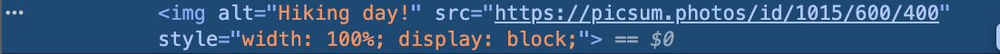

# Lab2-react-instagram
Repository containing all the information for Lab2 for CSCI-4360

Deployment Link: https://cosmic-youtiao-a445fa.netlify.app/

Screenshots:

Component Tree:
App
----> NavBar
----> Profile
----> Feed
--------> Composer
--------> PostCard
------------> CommentList
------------> CommentForm

State:
App.jsx (Application State): Manages global data like user information and authentication status. 
Feed.jsx (Feature State): Holds the array of all posts. It fetches post data and passes it down. 
PostCard.jsx (Component State): Manages the comments for a single post. 
Forms (Composer.jsx, CommentForm.jsx): Handle their own temporary input values as local state.
